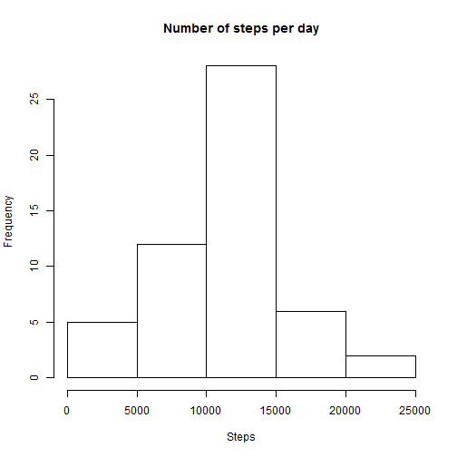
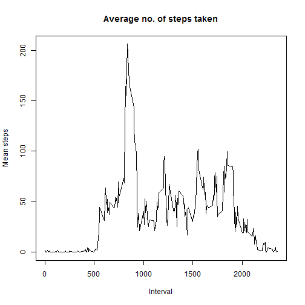
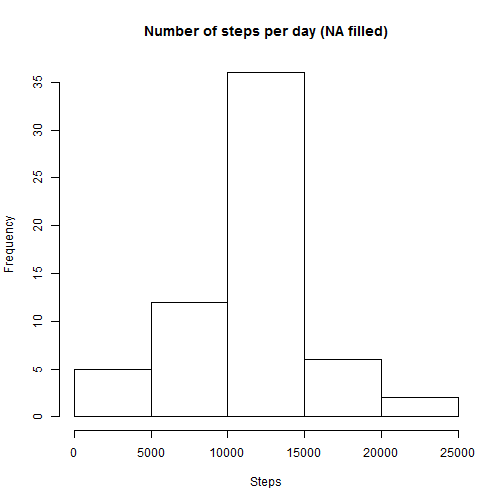
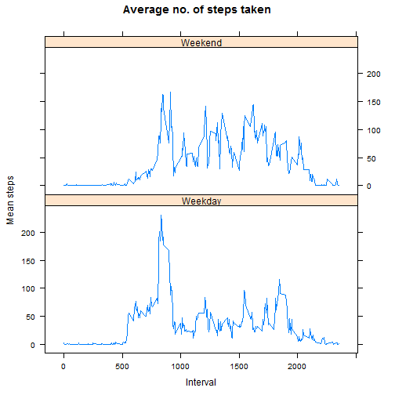

# PA1_template.Rmd

## Introduction

It is now possible to collect a large amount of data about personal movement using activity monitoring devices such as a Fitbit, Nike Fuelband, or Jawbone Up. These type of devices are part of the ¡°quantified self¡± movement ¨C a group of enthusiasts who take measurements about themselves regularly to improve their health, to find patterns in their behavior, or because they are tech geeks. But these data remain under-utilized both because the raw data are hard to obtain and there is a lack of statistical methods and software for processing and interpreting the data.

This assignment makes use of data from a personal activity monitoring device. This device collects data at 5 minute intervals through out the day. The data consists of two months of data from an anonymous individual collected during the months of October and November, 2012 and include the number of steps taken in 5 minute intervals each day.

## Loading and preprocessing the data

Load the data


```r
activity <- read.csv("activity.csv", stringsAsFactors = FALSE)
str(activity)
```

```
## 'data.frame':	17568 obs. of  3 variables:
##  $ steps   : int  NA NA NA NA NA NA NA NA NA NA ...
##  $ date    : chr  "2012-10-01" "2012-10-01" "2012-10-01" "2012-10-01" ...
##  $ interval: int  0 5 10 15 20 25 30 35 40 45 ...
```

Process the data: change "date" from chr into date format


```r
activity$date <- as.Date(activity$date)
str(activity)
```

```
## 'data.frame':	17568 obs. of  3 variables:
##  $ steps   : int  NA NA NA NA NA NA NA NA NA NA ...
##  $ date    : Date, format: "2012-10-01" "2012-10-01" ...
##  $ interval: int  0 5 10 15 20 25 30 35 40 45 ...
```

## What is mean total number of steps taken per day?

Calculate the total number of steps taken per day


```r
sumstep <- tapply(activity$steps, activity$date, sum)
```

Make a histogram of the total number of steps taken each day


```r
hist(sumstep, main = "Number of steps per day", xlab = "Steps")
```



Calculate and report the mean and median of the total number of steps taken per day


```r
## Mean
mean(sumstep, na.rm = TRUE)
```

```
## [1] 10766.19
```

```r
## Median
median(sumstep, na.rm = TRUE)
```

```
## [1] 10765
```

## What is the average daily activity pattern?

Make a time series plot of the 5-minute interval (x-axis) and the average number of steps taken, averaged across all days (y-axis)


```r
library(dplyr)
meanstep_itv <- summarise(group_by(activity, interval), 
                          mean = mean(steps, na.rm = TRUE))
plot(meanstep_itv$interval, meanstep_itv$mean, type = "l", 
     main = "Average no. of steps taken", xlab = "Interval", ylab = "Mean steps")
```



Which 5-minute interval, on average across all the days in the dataset, contains the maximum number of steps?


```r
meanstep_itv[meanstep_itv$mean == max(meanstep_itv$mean), 1]
```

```
## # A tibble: 1 x 1
##   interval
##      <int>
## 1      835
```

## Imputing missing values

Calculate and report the total number of missing values in the dataset (i.e. the total number of rows with NAs)


```r
## N/A in dates
sum(is.na(activity$date))
```

```
## [1] 0
```

```r
## N/A in steps
sum(is.na(activity$steps))
```

```
## [1] 2304
```

Devise a strategy for filling in all of the missing values in the dataset.  
* Strategy: use the mean for the 5-minute interval.  
Create a new dataset that is equal to the original dataset but with the missing data filled in.


```r
activity_new <- activity
itvmean <- tapply(activity_new$steps, activity_new$interval, mean, na.rm=TRUE, simplify = TRUE)
naindex<- is.na(activity_new$steps)
activity_new$steps[naindex] <- itvmean[as.character(activity_new$interval[naindex])]
## To check if all N/A data are replaced
sum(is.na(activity_new))
```

```
## [1] 0
```

Make a histogram of the total number of steps taken each day and Calculate and report the mean and median total number of steps taken per day. 


```r
sumstep_new <- tapply(activity_new$steps, activity_new$date, sum)
hist(sumstep_new, main = "Number of steps per day (NA filled)", xlab = "Steps")
```



```r
## Mean
mean(sumstep_new, na.rm = TRUE)
```

```
## [1] 10766.19
```

```r
## Median
median(sumstep_new, na.rm = TRUE)
```

```
## [1] 10766.19
```

Q: Do these values differ from the estimates from the first part of the assignment? 

* A: The mean kept the same (10766.19) after filling the NAs; and the median increased from 10765 to 10766.19 after filling the NAs.

Q: What is the impact of imputing missing data on the estimates of the total daily number of steps?

* A: Total daily number of steps increased because the filled data are all equal to or above 0.

# Are there differences in activity patterns between weekdays and weekends?

Create a new factor variable in the dataset with two levels ¨C ¡°weekday¡± and ¡°weekend¡± indicating whether a given date is a weekday or weekend day.


```r
library(lubridate)
activity_new$wday <- 
        ifelse(wday(activity_new$date) %in% c(1,7), "Weekend", "Weekday")
activity_new$wday <- as.factor(activity_new$wday)
str(activity_new)
```

```
## 'data.frame':	17568 obs. of  4 variables:
##  $ steps   : num  1.717 0.3396 0.1321 0.1509 0.0755 ...
##  $ date    : Date, format: "2012-10-01" "2012-10-01" ...
##  $ interval: int  0 5 10 15 20 25 30 35 40 45 ...
##  $ wday    : Factor w/ 2 levels "Weekday","Weekend": 1 1 1 1 1 1 1 1 1 1 ...
```

Make a panel plot containing a time series plot (i.e. type = "l") of the 5-minute interval (x-axis) and the average number of steps taken, averaged across all weekday days or weekend days (y-axis). 


```r
meanstep_itv2 <- summarise(group_by(activity_new, interval, wday),
                           mean = mean(steps))
library(lattice)
xyplot(mean~interval|wday, meanstep_itv2, type="l", layout = c(1,2),
       main="Average no. of steps taken", xlab="Interval",
       ylab="Mean steps")
```



Q: Are there differences in activity patterns between weekdays and weekends?

* A: Yes, activity patterns are difference between weekdays and weekends.
